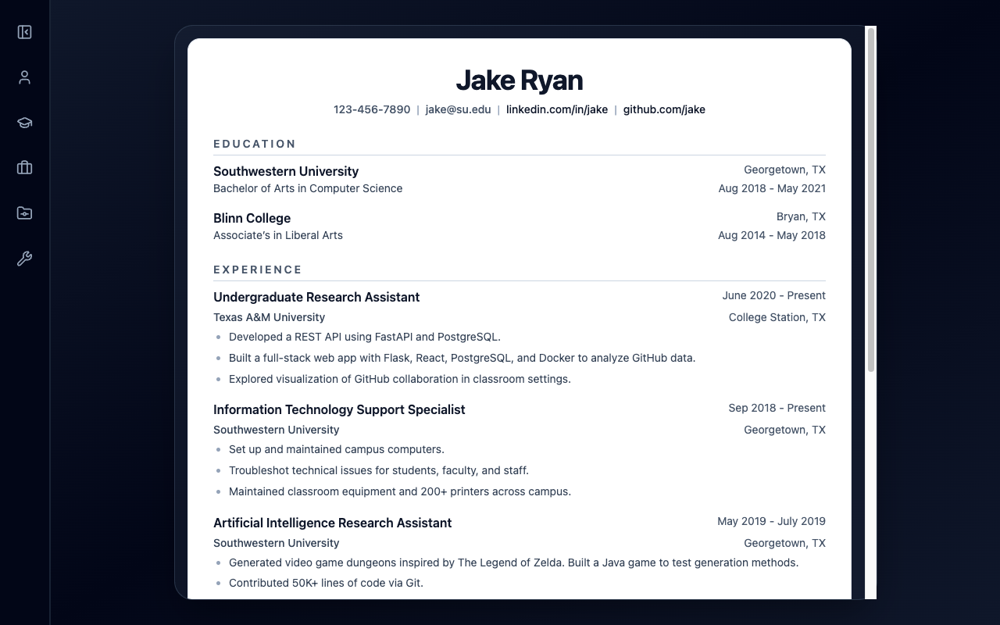

# Resume Builder

A React resume editor with a split editing workspace and a live document preview. Form
edits to personal info, education, experience, projects, and skills update the rendered
résumé in real time from a single structured data model.

🔗 **Live demo:** [resume-builder-ashy-tau.vercel.app](https://resume-builder-ashy-tau.vercel.app/)



## Features

- Sidebar-driven editing flow for moving between résumé sections.
- Structured form panels for personal info, experience, education, projects, and skills.
- Live résumé preview that updates as fields change.
- Add/remove repeated sections (e.g. multiple jobs or projects).

## Tech stack

React · Vite · Tailwind CSS · `lucide-react`

## Getting started

```bash
npm install
npm run dev          # Vite dev server
npm run build        # production build
```

## What I practiced

Keeping the résumé as a **single source-of-truth state object**, rendering a live
preview from that state, and managing dynamic add/remove lists of sections.

## License

Odin Project coursework — original implementation by Aziz Umarov.
